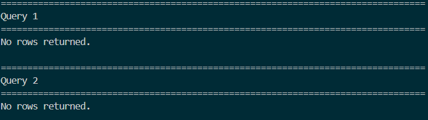
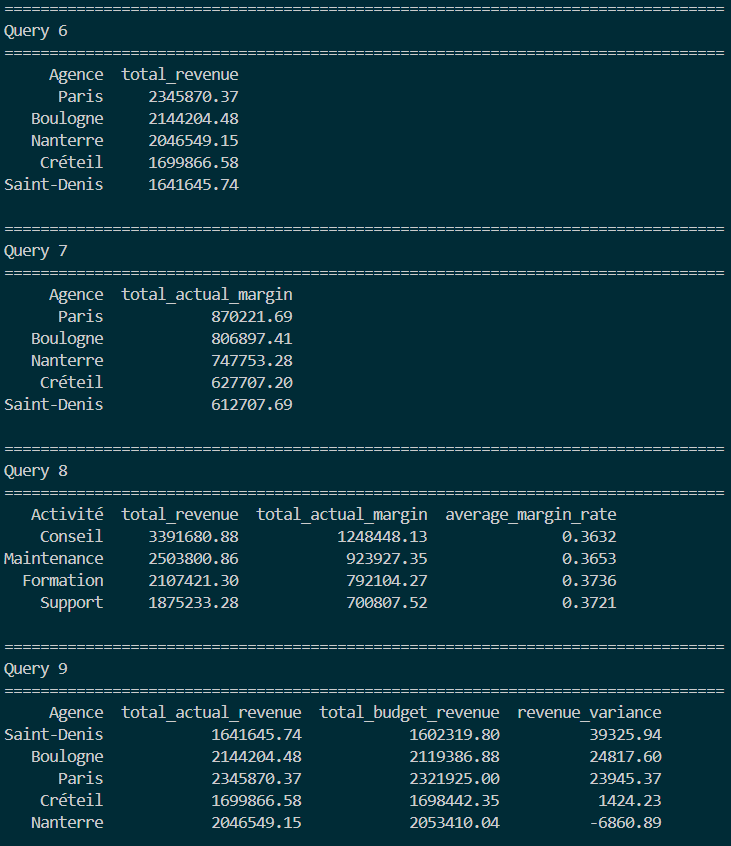
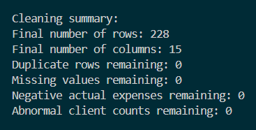

# Financial Reporting Automation

## Project Objective

This project automates the cleaning and preparation of a raw financial reporting dataset using Python.

The goal is to transform an imperfect Excel file into a clean and reliable dataset that can be used for financial reporting, analysis, SQL queries, or Power BI dashboards.

## Tools Used

- Python
- pandas
- openpyxl
- Excel

## Data Quality Controls

The Python script performs several data quality checks:

- Detects and removes duplicate rows
- Detects missing values in critical reporting columns
- Removes incomplete records when required
- Detects and corrects invalid agency names using a reference list
- Detects and removes negative actual expenses
- Detects and removes abnormal client counts
- Converts and standardizes date formats

## Financial Indicators Created

The script also creates financial performance indicators:

- Actual margin
- Budget margin
- Revenue variance
- Expense variance
- Margin rate

## Project Structure

```text
financial-reporting-automation/
├── data/
│   ├── raw/
│   │   └── financial_reporting_raw.xlsx
│   └── cleaned/
│       └── financial_reporting_cleaned.xlsx
├── scripts/
│   └── clean_financial_data.py
├── sql/
├── powerbi/
├── images/
├── README.md
└── requirements.txt
```

## How to Run the Project

Install the required libraries:

```bash
pip install -r requirements.txt
```

Run the cleaning script:

```bash
python scripts/clean_financial_data.py
```

The cleaned file is exported to:

```text
data/cleaned/financial_reporting_cleaned.xlsx
```
## SQL Analysis

After the cleaned Excel file is generated, the project creates a local SQLite database to run SQL audit and financial analysis queries.

The SQLite database is created from:

```text
data/cleaned/financial_reporting_cleaned.xlsx
```

The database file is generated here:

```text
data/cleaned/financial_reporting.db
```

The SQL queries are stored in:

```text
sql/01_financial_analysis_queries.sql
```

The SQL part of the project includes:

- Data quality audit queries
- Duplicate checks
- Missing value checks
- Invalid agency name checks
- Negative expense checks
- Abnormal client count checks
- Revenue analysis by agency
- Margin analysis by agency and activity
- Budget variance analysis
- Monthly revenue trend analysis

To create the SQLite database, run:

```bash
python scripts/create_sqlite_database.py
```

To execute the SQL audit and analysis queries, run:

```bash
python scripts/run_sql_analysis.py
```
### SQL Quality Audit Example

The SQL audit queries verify that no critical data quality issues remain after the Python cleaning process.



### SQL Financial Analysis Example

The SQL analysis queries produce financial insights such as revenue by agency, margin by activity and budget variance.


## Output

The final cleaned dataset contains:

- No duplicate rows
- No missing values in critical fields
- No invalid agency names
- No negative actual expenses
- No abnormal client counts
- Standardized date values
- Financial performance indicators ready for reporting

## Business Value

This project demonstrates how Python can be used to automate financial data preparation, reduce manual Excel cleaning, improve reporting reliability, and prepare clean datasets for analysis or dashboarding.

## Skills Demonstrated

This project demonstrates the ability to:

- Structure a Python data project
- Load and process Excel files with pandas
- Apply data quality checks
- Use business rules to clean financial data
- Create financial indicators
- Export clean datasets for reporting
- Prepare data for further analysis in SQL or Power BI

## Cleaning Summary

The cleaning script produces a final quality control summary after processing the raw dataset.

